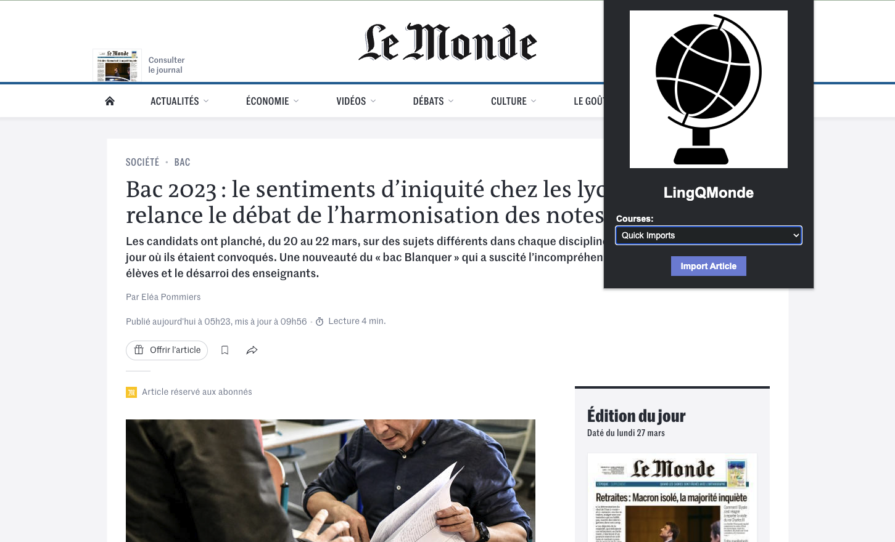

# LingQMonde

A chrome extension for importing the full text of Le Monde articles into LingQ.

## Background

[Le Monde](lemonde.fr) is a major French daily newspaper that covers a wide variety of topics. As such, it provides a trove of material for French language learners, at a variety of literacy levels.

[LingQ](lingq.com) is a language learning site and app based around [Stephen Krashen's input hypothesis](https://en.wikipedia.org/wiki/Input_hypothesis) of language acquisition. It supports importing text input for self-study, and provides a chrome extension for saving web pages as lessons.

However, this importing is done server-side: the page's URL is sent to LingQ, which then fetches the page. This is an issue for a site like Le Monde, where the content is largely accessible only to subscribers.

This extension is for subscribers to Le Monde who want to easily save articles to LingQ for personal study. It works by pulling the article headline, description, and text directly off the page as rendered in the browser, and imports the text into LingQ directly rather than through a URL. 

